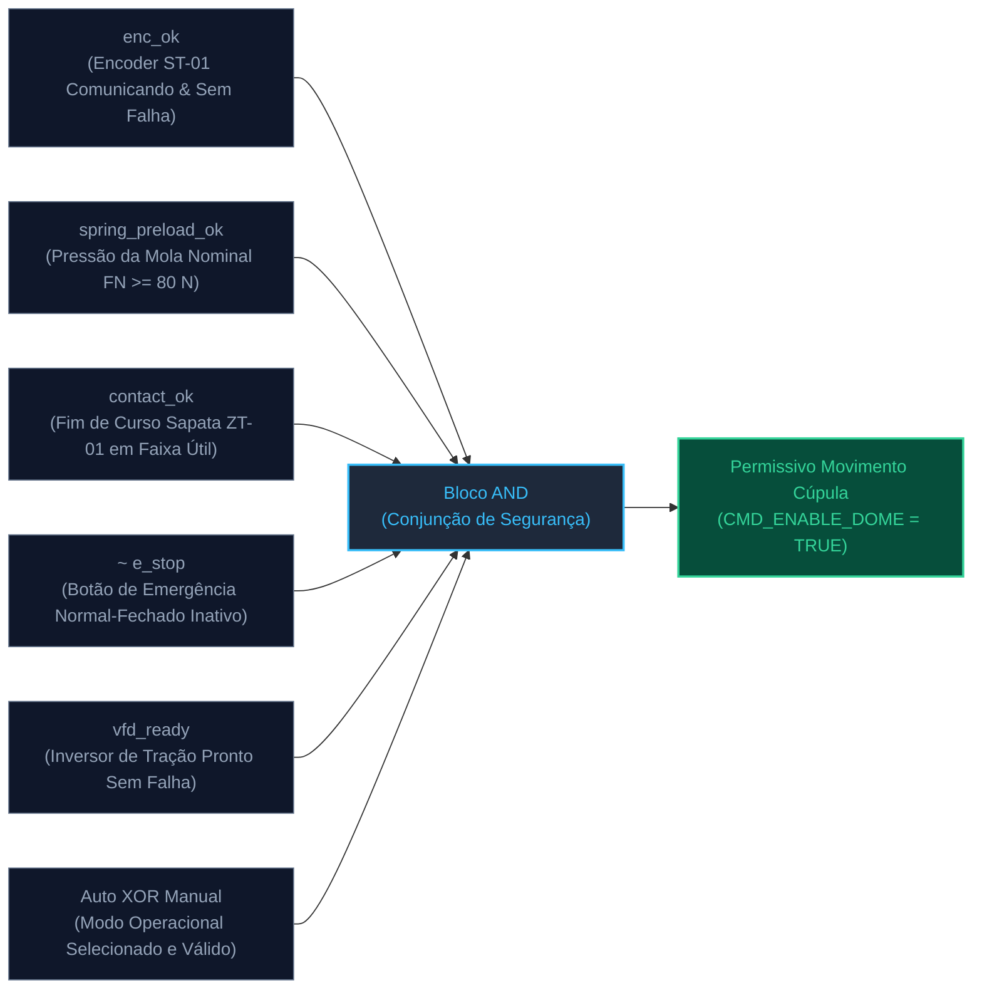
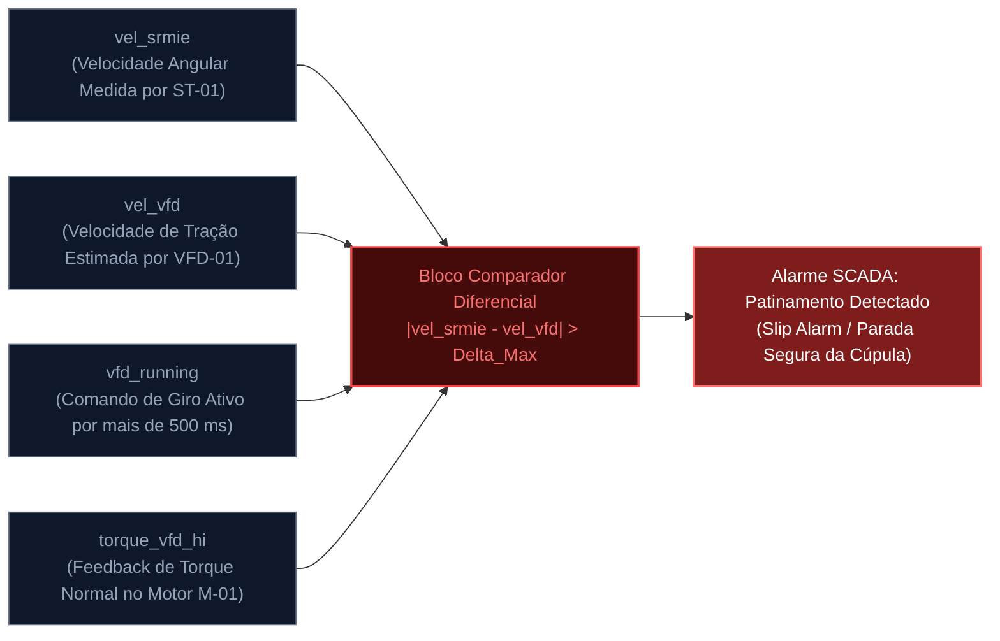
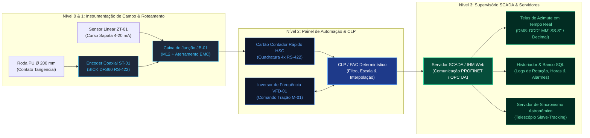

# Documentação Técnica de Engenharia: Sistema de Roda de Medição Independente com Encoder (SRMIE)
## Arquitetura Mecânica em Pedestal Compacto & Integração SCADA / Automação

**Documento:** DT-SRMIE-SCADA-001-REV01  
**Projeto:** Automação, Instrumentação Azimutal e Supervisão SCADA de Cúpula Astronômica  
**Data:** Setembro de 2026  
**Instituição:** UNIFEI / LNA (Laboratório Nacional de Astrofísica)  
**Disciplina:** Engenharia Mecatrônica, Automação Industrial e Sistemas de Controle  
**Classificação:** Documentação Técnica de Engenharia / Projeto Executivo  
**Normas Aplicáveis:** ISA-5.1 (Simbologia e Identificação de Instrumentação), ANSI/ISA-95 (Modelagem Hierárquica de Automação), IEC 61131-3 (Lógica de Controle), IEC 60204-1 (Segurança de Máquinas).

---

## 1. Resumo Executivo e Princípio Físico de Operação

### 1.1 Contexto e Desacoplamento Metrológico
O rastreamento de alvos celestes por telescópios astronômicos modernos exige que a abertura da fenda da cúpula sincronize seu azimute com tolerâncias submimétricas e repetibilidade sub-arcminuto. Em estruturas mecânicas tradicionais de grande porte (diâmetros de $3\text{ a }10\text{ metros}$), a medição azimutal comumente aproveita encoders rotativos acoplados aos eixos dos motores elétricos de tração ou às rodas de sustentação que suportam as toneladas do domo. 

Essa abordagem clássica introduz erros severos de histerese e perda cumulativa de passos devido a:
1. **Patinamento por Tração (*Slip/Creep*):** O escorregamento inevitável entre o pneu trator de borracha e o trilho de aço durante partidas, frenagens e inversões de rotação.
2. **Deformações Elásticas Estruturais:** Variações sazonais de temperatura e vento deformam o perfil da pista de sustentação, alterando o raio de contato dinâmico sob cargas estáticas oscilantes.

O **Sistema de Roda de Medição Independente com Encoder (SRMIE)** soluciona essa limitação por meio do **desacoplamento funcional absoluto ($100\%$) entre esforço trator de movimentação e medição metrológica de deslocamento**. O conjunto opera estritamente como um leitor tátil cinemático que roda livre de qualquer carga de sustentação ou transmissão de potência, assegurando regime de **rolamento puro sem deslizamento**.

```
[ PISTA DA CÚPULA Ø 3000 mm ] <=== (Contato Tangencial Puro FN = 120 N) === [ RODA PU Ø 200 mm ]
                                                                                   |
                                                                       [Eixo Vertical / Fole Metálico]
                                                                                   |
                                                                         [ ENCODER SICK DFS60 ]
                                                                                   |
                                                                         [ Haste Curta h=240 mm ]
                                                                                   |
                                                                         [ SAPATA MÓVEL HIWIN ]
                                                                           ▲               ▲
                                                                           │               │
     [ BATENTE FIXO ESTRUTURAL ] <====== (Mola de Compressão k = 12 N/mm) ─┘               │
                                                                                           │
     [ PISO DO OBSERVATÓRIO & MURETA ] <═══════════════════════════════════════════════════╝
```

### 1.2 Cinemática de Ação e Reação Direta da Mola de Base
A arquitetura consolidada adota um **pedestal mecânico compacto hiperestático** com translação prismática de um único grau de liberdade ($1\text{-DOF}$ radial no eixo $X$):

- **Roda de Medição Horizontal ($XZ$):** Disco de precisão em alumínio com banda elastomérica retificada, operando deitado no plano horizontal na cota do anel da cúpula ($Y = 0{,}856\,\text{m}$), tangenciando a pista interna.
- **Encoder Coaxial Inferior:** Montado coaxialmente imediatamente abaixo da roda ($Y = 0{,}766\,\text{m}$), com a face do eixo voltada para cima. Essa disposição preserva o sensor contra acúmulo de poeira e partículas abrasivas, enquanto mantém concentricidade perfeita com o eixo vertical da roda.
- **Haste Vertical Rígida Encurtada:** Coluna tubular curta de diâmetro $\varnothing 40\,\text{mm}$ e altura de apenas $h = 240\,\text{mm}$ (redução de $\approx 67\%$ sobre projetos esbeltos anteriores). Quatro mísulas triangulares de alta espessura travam a raiz do tubo à sapata deslizante, conferindo altíssima rigidez à flexão e eliminando qualquer ressonância dinâmica ou vibração parasita (*chatter*).
- **Mola Horizontal de Pressão Direta:** Uma mola helicoidal de compressão em aço temperado (diâmetro de arame de $4{,}8\,\text{mm}$ e rigidez $k = 12\,\text{N/mm}$) atua na cota intermediária ($Y = 0{,}520\,\text{m}$). A extremidade reativa apoia-se em um batente rígido soldado ao pilar de fundação, enquanto a extremidade ativa aplica uma pré-carga constante ($F_N \approx 120\,\text{N}$) na face traseira da sapata móvel.
- **Absorção de Excentricidade sem Deflexão Angular:** Quando a cúpula gira, irregularidades geométricas, ovalizações e variações térmicas de até $\pm 30\,\text{mm}$ fazem a sapata móvel avançar ou recuar suavemente sobre o par de guias lineares retificadas. Por se tratar de um curso estritamente linear, **o ângulo de contato da roda com o anel mantém-se perfeitamente perpendicular a $90{,}00^{\circ}$ em qualquer azimute**, evitando torções e desgastes em cunha.

---

## 2. Especificações Técnicas e Dimensionamento Cinemático

### 2.1 Tabela de Parâmetros Dimensionais e Construtivos

| Parâmetro de Engenharia | Símbolo | Valor Adotado | Tolerância de Projeto | Unidade |
|:---|:---:|:---:|:---:|:---:|
| Diâmetro nominal do anel guia da cúpula | $D_{\text{cúpula}}$ | $3000{,}0$ | $\pm 5{,}0$ | $\text{mm}$ |
| Raio nominal da pista de rolagem | $R_{\text{cúpula}}$ | $1500{,}0$ | $\pm 2{,}5$ | $\text{mm}$ |
| Diâmetro da roda de medição (Opção Alta Inércia) | $D_{\text{roda}}$ | **$200{,}0$** | $\pm 0{,}02$ (pós-retífica) | $\text{mm}$ |
| Diâmetro da roda de medição (Opção Compacta) | $D_{\text{roda,comp}}$ | **$100{,}0$** | $\pm 0{,}02$ (pós-retífica) | $\text{mm}$ |
| Largura de contato da banda elastomérica | $b_{\text{banda}}$ | $20{,}0$ | $\pm 0{,}2$ | $\text{mm}$ |
| Material e dureza da banda de rodagem | - | Poliuretano (PU) TDI | $85\text{ a }90$ | Shore A |
| Altura livre da haste vertical | $h_{\text{haste}}$ | $240{,}0$ | $\pm 0{,}5$ | $\text{mm}$ |
| Diâmetro externo da haste tubular | $\varnothing_{\text{haste}}$ | $40{,}0$ | $\pm 0{,}1$ | $\text{mm}$ |
| Cota de contato tangencial da roda | $Y_{\text{roda}}$ | $856{,}0$ | $\pm 1{,}0$ | $\text{mm}$ |
| Cota de montagem do encoder coaxial | $Y_{\text{encoder}}$ | $766{,}0$ | $\pm 1{,}0$ | $\text{mm}$ |
| Cota da linha de atuação da mola | $Y_{\text{mola}}$ | $520{,}0$ | $\pm 0{,}5$ | $\text{mm}$ |
| Cota superior da mesa de guias lineares | $Y_{\text{mesa}}$ | $470{,}0$ | $\pm 1{,}0$ | $\text{mm}$ |
| Curso útil admissível da sapata móvel | $S_{\text{util}}$ | $\pm 30{,}0$ | Limite mecânico $\pm 45{,}0$ | $\text{mm}$ |
| Comprimento dos trilhos lineares | $L_{\text{trilho}}$ | $240{,}0$ | $\pm 1{,}0$ | $\text{mm}$ |
| Constante elástica da mola helicoidal | $k$ | **$12{,}0$** | $\pm 0{,}5$ | $\text{N/mm}$ |
| Pré-compressão estática nominal ($\Delta x_0$) | $\Delta x_0$ | $10{,}0$ | $\pm 1{,}0$ | $\text{mm}$ |
| **Força normal estática de contato** | $F_N$ | **$120{,}0$** | $\pm 12{,}0$ ($\approx 12{,}2\text{ kgf}$) | $\text{N}$ |
| Faixa de força operacional (curso dinâmico $\pm 15\text{ mm}$) | $F_{N,\text{op}}$ | $60\text{ a }180$ | Estável | $\text{N}$ |

### 2.2 Modelagem Matemática e Resolução Azimutal

#### Relação Geométrica de Transmissão ($\gamma$)
Considerando a hipótese fundamental de rolamento puro sem escorregamento entre corpos indeformáveis na interface elastomérica:

$$v_{\text{tangencial}} = \omega_{\text{cúpula}} \cdot R_{\text{cúpula}} = \omega_{\text{roda}} \cdot r_{\text{roda}}$$

Integrando no domínio do tempo para um deslocamento angular contínuo, a razão cinemática ideal ($\gamma$) é dada por:

$$\gamma = \frac{D_{\text{cúpula}}}{D_{\text{roda}}}$$

1. Para a **Roda de $\varnothing 200\,\text{mm}$:**
   $$\gamma = \frac{3000\,\text{mm}}{200\,\text{mm}} = 15{,}0000$$
2. Para a **Roda de $\varnothing 100\,\text{mm}$:**
   $$\gamma = \frac{3000\,\text{mm}}{100\,\text{mm}} = 30{,}0000$$

#### Decodificação em Quadratura ($4\times$) e Resolução Angular
O encoder industrial emite trens de pulsos defasados em $90^{\circ}$ elétricos (canais $A$ e $B$). O módulo de contagem rápida de alta velocidade (HSC - *High Speed Counter*) do CLP detecta todas as transições (subidas e descidas), multiplicando por quatro o número de passos por volta:

$$\text{Passos/Volta}_{\text{roda}} = 4 \times \text{PPR}_{\text{nativo}}$$

O número total acumulado de pulsos discretos para uma rotação completa de $360^{\circ}$ da cúpula astronômica ($N_{\text{total}}$) é:

$$N_{\text{total}} = 4 \times \text{PPR} \times \gamma = 4 \times \text{PPR} \times \left(\frac{D_{\text{cúpula}}}{D_{\text{roda}}}\right)$$

A resolução azimutal incremental mínima obtida ($\delta\theta_{\text{cúpula}}$) resulta em:

$$\delta\theta_{\text{graus}} = \frac{360^{\circ}}{N_{\text{total}}} \quad [^{\circ}/\text{pulso}]$$

$$\delta\theta_{\text{arcsec}} = \delta\theta_{\text{graus}} \times 3600 \quad [\text{segundos de arco / pulso}]$$

#### Matriz de Desempenho Angular por Configuração

| Diâmetro Roda ($D_{\text{roda}}$) | Sensor / Resolução Nativa | Pulsos $4\times$ por Volta Roda | Razão $\gamma$ | Pulsos/360° Cúpula ($N_{\text{total}}$) | Resolução Decimal (°/pulso) | Resolução em Segundos de Arco |
|:---:|:---|:---:|:---:|:---:|:---:|:---:|
| **$\varnothing 200\,\text{mm}$** | DFS60 ($1.024\,\text{PPR}$) | $4.096$ | $15$ | **$61.440$** | **$0{,}005859^{\circ}$** | **$21{,}10''$** |
| **$\varnothing 200\,\text{mm}$** | DFS60 ($10.000\,\text{PPR}$) | $40.000$ | $15$ | **$600.000$** | **$0{,}000600^{\circ}$** | **$2{,}16''$** |
| **$\varnothing 200\,\text{mm}$** | DFS60 (`DFS60A`, $65.536\,\text{PPR}$) | $262.144$ | $15$ | **$3.932.160$** | **$0{,}0000915^{\circ}$** | **$0{,}330''$** |
| **$\varnothing 100\,\text{mm}$** | DFS60 ($1.024\,\text{PPR}$) | $4.096$ | $30$ | **$122.880$** | **$0{,}002930^{\circ}$** | **$10{,}55''$** |
| **$\varnothing 100\,\text{mm}$** | DFS60 ($10.000\,\text{PPR}$) | $40.000$ | $30$ | **$1.200.000$** | **$0{,}000300^{\circ}$** | **$1{,}08''$** |
| **$\varnothing 100\,\text{mm}$** | DFS60 (`DFS60A`, $65.536\,\text{PPR}$) | $262.144$ | $30$ | **$7.864.320$** | **$0{,}0000458^{\circ}$** | **$0{,}165''$** |

> [!NOTE]
> A roda de $\varnothing 200\,\text{mm}$ combinada com o encoder SICK programado em $65.536\,\text{PPR}$ atinge resolução de **$0{,}330$ segundos de arco** ($\approx 1/10.000^{\circ}$), viabilizando sincronismo automático com fendas de espectrógrafos de alta dispersão.

---

## 3. Lista de Componentes Comerciais de Mercado (BOM) e Fornecedores

A tabela a seguir consolida a lista de materiais certificados para uso industrial contínuo em ambientes de observatórios astronômicos:

| Item | Tag ISA-5.1 | Descrição Detalhada | Fabricante / Modelo de Referência | Especificação Chave | Qtd. |
|:---:|:---:|:---|:---|:---|:---:|
| **1.1** | **`ST-01`** | **Encoder Incremental Programável** | **SICK**<br>Modelo: `DFS60A-S4AK65536` | Resolução ajustável até $65.536\,\text{PPR}$, eixo maciço $\varnothing 10\,\text{mm}$, flange servo/faceira $\varnothing 50\,\text{mm}$, IP67, saída diferencial RS-422 TTL/HTL, conector industrial metálico M12 8 pinos. | 1 un. |
| **1.2** | **`ST-01` (Alt)** | **Encoder Absoluto Multivoltas** | **KÜBLER**<br>Modelo: `Sendix F5868` | Resolução singleturn 16 bits + multiturn 12 bits, interface PROFINET / EtherNet/IP ou SSI, invólucro marítimo IP67, eixo $\varnothing 10\,\text{mm}$, sem perda de referência em falta de energia. | 1 un. |
| **1.3** | **`ZT-01`** | **Transmissor de Deslocamento Linear** | **GEFRAN**<br>Modelo: `LT-M-0050-S` | Potenciométrico industrial, curso $50\,\text{mm}$, saída $4\text{ a }20\,\text{mA}$, precisão $\pm 0{,}05\%$, IP65. Instalado lateralmente para aferir deflexão da mola e desgaste de PU. | 1 un. |
| **2.1** | **MEC-01** | **Trilho Guia Linear Retificado** | **HIWIN**<br>Série: `HGR20R-240-H` | Par de trilhos de aço temperado retificado classe H, tratamento superficial anticorrosivo de cromo duro (*Raydent*), $L = 240\,\text{mm}$, furação M5. | 2 un. |
| **2.2** | **MEC-02** | **Patins Lineares com Raspadores** | **HIWIN**<br>Série: `HGW20CC-ZB-H` | 4 patins flangeados com esferas recirculantes, pré-carga média ZB (alta rigidez sem folga radial), vedação dupla frontal e raspadores azuis contra pó e umidade. | 4 un. |
| **3.1** | **`SE-01`** | **Roda de Medição de Alta Precisão** | **Usinagem Especializada**<br>(Desenho Próprio / Kübler) | Núcleo usinado CNC em Alumínio 6061-T6 com 8 raios aliviados e parafusos no aro. Banda fundida em Poliuretano TDI 85–90 Shore A, retificada concentricamente para $\varnothing 200{,}00 \pm 0{,}02\,\text{mm}$ (ou $\varnothing 100{,}00\,\text{mm}$). Furo central H7. | 1 un. |
| **4.1** | **MEC-03** | **Acoplamento Flexível Fole Metálico** | **R+W Antriebselemente**<br>Modelo: `BK3 / 15 / 10-20` | Acoplamento elástico tipo fole metálico (Bellows) em aço inoxidável multicamadas. Fixação radial por abraçadeira, zero folga torsional (*zero-backlash*), rigidez torsional $2.800\,\text{N}\cdot\text{m/rad}$, furos $\varnothing 10\,\text{mm} \times \varnothing 20\,\text{mm}$. | 1 un. |
| **5.1** | **MEC-04** | **Mola Helicoidal de Compressão** | **Sotreq / Molas Brasil**<br>Ref: `MC-30-130-12` | Aço mola DIN 17223 Classe C (SAE 1070 zincado a fogo) ou Inox AISI 302. Fio $\varnothing 4{,}8\,\text{mm}$, externo $\varnothing 30{,}0\,\text{mm}$, $L_0 = 130\,\text{mm}$, $k = 12\,\text{N/mm}$, pontas esquadrejadas e retificadas. | 1 un. |
| **6.1** | **ESTR-01** | **Estrutura Metálica do Pedestal** | **Caldeiraria & Usinagem CNC** | Pilar de fundação tubular $80 \times 80 \times 4\,\text{mm}$ ASTM A36 com flange de piso $16\,\text{mm}$, mão-francesa de parede, mesa intermediária aplainada $14\,\text{mm}$, coluna curta $\varnothing 40 \times 5\,\text{mm}$ ($h=240\,\text{mm}$) em Alumínio 6061 com 4 mísulas soldadas. | 1 cj. |
| **7.1** | **CAB-01** | **Cabo Blindado Flexível PUR** | **LAPP GROUP**<br>Modelo: `ÖLFLEX ROBUST 210` | Cabo 4 pares trançados ($4 \times 2 \times 0{,}25\,\text{mm}^2$), condutores estanhados, blindagem em malha trançada cobre $>85\%$, capa externa em PUR preto/amarelo resistente a raios UV, óleos e baixas temperaturas ($-40^{\circ}\text{C}$). | 10 m |
| **7.2** | **`JB-01`** | **Caixa de Junção e Conectividade** | **PHOENIX CONTACT**<br>ou **WEIDMÜLLER** | Caixa de alumínio injetado IP66 montada na base elevada, equipada com bornes push-in aterrados com mola EMC de aterramento periférico de malha e conector M12 fêmea metálico 8 pólos. | 1 cj. |
| **8.1** | **FIX-01** | **Chumbadores de Alta Performance** | **HILTI**<br>Modelo: `HST3 M12x115/20` | Chumbadores metálicos de expansão Parabolt M12 em aço zincado homologados para concreto estrutural fissurado. Conjunto de parafusos Allen DIN 912 Inox A2-70 com arruelas de pressão. | 1 cj. |

---

## 4. Estimativa de Custos de Implementação (BRL e USD)

Os valores foram orçados com base em cotações industriais reais no Brasil e convertidos pela taxa cambial referencial de $\text{US\$ } 1{,}00 = \text{R\$ } 5{,}50$.

### 4.1 Tabela Orçamentária por Categoria

```
=========================================================================================================
CATEGORIA   DISCRIMINAÇÃO DOS CUSTOS                   FORNECEDOR / BASE         CUSTO (BRL)  CUSTO (USD)
=========================================================================================================
1.0         SENSORES E INSTRUMENTAÇÃO
1.1         Encoder Incremental SICK DFS60 (Programável) SICK do Brasil          R$ 1.850,00     $ 336.36
1.2         Transmissor Linear Sapata GEFRAN ZT-01      Gefran Brasil            R$   620,00     $ 112.73
1.3         Conector M12 Metálico Blindado 8 Pinos IP67  Phoenix Contact         R$    95,00     $  17.27
1.4         Caixa de Junção JB-01 em Alumínio IP66      Weidmüller               R$   180,00     $  32.73
            ---------------------------------------------------------------------------------------------
            Subtotal Sensores e Instrumentação                                   R$ 2.745,00     $ 499.09

2.0         ELEMENTOS DE MÁQUINA E GUIAS LINEARES
2.1         Par de Trilhos Retificados HIWIN HGR20 (240 mm) Kalatec Automação    R$   420,00     $  76.36
2.2         4 Patins Flangeados HIWIN HGW20CC com Vedação Kalatec Automação      R$   580,00     $ 105.45
2.3         Acoplamento Fole Metálico R+W Zero-Backlash   R+W / Kalatec          R$   290,00     $  52.73
2.4         Mola Helicoidal de Compressão DIN 17223      Molas Brasil            R$    65,00     $  11.82
            ---------------------------------------------------------------------------------------------
            Subtotal Elementos de Máquina                                        R$ 1.355,00     $ 246.36

3.0         MATÉRIA-PRIMA E SERVIÇOS DE USINAGEM CNC
3.1         Tarugos de Alumínio 6061-T6 (Roda Ø 200, Coluna) Metal Comercial     R$   380,00     $  69.09
3.2         Chapas e Tubos Estruturais Aço ASTM A36      Gerdau / Açofer         R$   210,00     $  38.18
3.3         Usinagem CNC (Torno, Fresa e Furações Flange) Oficina Especializada  R$   950,00     $ 172.73
3.4         Vulcanização e Retífica Banda PU 85 Shore A   Poliuretanos Ind.       R$   380,00     $  69.09
3.5         Tratamento de Superfície (Anodização / Pintura) Tratamentos Ind.     R$   190,00     $  34.55
            ---------------------------------------------------------------------------------------------
            Subtotal Matéria-Prima e Usinagem CNC                                R$ 2.110,00     $ 383.64

4.0         CABEAMENTO, CONECTORES E MISCELÂNEAS
4.1         Cabo Especial PUR 4 Pares Trançados (10 m)   Lapp Group              R$   140,00     $  25.45
4.2         Kit 4 Chumbadores Parabolt Hilti M12x115 HST3 Hilti Brasil           R$    88,00     $  16.00
4.3         Parafusos Allen Inox DIN 912, Arruelas, Prensa-Cabos Ciser / Metal   R$   110,00     $  20.00
            ---------------------------------------------------------------------------------------------
            Subtotal Cabeamento e Miscelâneas                                    R$   338,00     $  61.45

5.0         MÃO DE OBRA DE ENGENHARIA E COMISSIONAMENTO
5.1         Ajustagem Mecânica de Bancada e Acoplamento  Técnico Mecatrônico     R$   600,00     $ 109.09
5.2         Ancoragem Civil, Nivelamento e Alinhamento   Engenheiro Mecânico     R$   900,00     $ 163.64
5.3         Parametrização HSC no CLP, Telas SCADA e Calibração Eng. Automação   R$   850,00     $ 154.55
            ---------------------------------------------------------------------------------------------
            Subtotal Mão de Obra Técnica                                         R$ 2.350,00     $ 427.27
=========================================================================================================
TOTAL GERAL CONSOLIDADO (PROTÓTIPO OPERACIONAL HOMOLOGADO)                       R$ 8.898,00   US$ 1.617,82
=========================================================================================================
```

### 4.2 Projeção para Lote Industrial Seriados (3 a 5 Unidades)
Com a amortização das taxas de programação CNC e a compra em lote de trilhos e componentes SICK, o custo unitário por módulo montado cai para **R$ 5.100,00 a R$ 5.600,00 (US$ 927 a US$ 1.018)**.

---

## 5. Vantagens da Solução Adotada

A configuração em pedestal compacto hiperestático supera amplamente os métodos concorrentes:

```
+----------------------------------------------------+----------------------------------------------------+
| ARRANJOS ANTERIORES (BRAÇOS PANTOGRÁFICOS)         | ARQUITETURA CONSOLIDADA (PEDESTAL COMPACTO SRMIE)  |
+----------------------------------------------------+----------------------------------------------------+
| • Articulações pivotantes com pinos cilíndricos e  | • Guia linear prismática retificada de alta carga; |
|   buchas de bronze geram folga angular reversa.    |   zero folga angular ou torcional (backlash zero). |
| • Movimento em arco altera continuamente o ângulo  | • Translação pura 1-DOF: incidência tangencial a   |
|   de ataque da roda contra o trilho.               |   rigorosos 90,00° em qualquer ponto da pista.     |
| • Coluna esbelta longa sujeita a vibrações de      | • Haste curta (h = 240 mm) com momento de inércia  |
|   flexão e efeito mola parasita sob aceleração.    |   elevado; rigidez dinâmica absoluta.              |
| • Vigas suspensas obstruem o topo e competem com   | • Topo da cúpula 100% desobstruído; livre trânsito |
|   as portas do obturador da fenda do telescópio.   |   das portas, fiação umbilical e calhas de luz.    |
| • Manutenção perigosa em altura sobre escadas.     | • Toda a manutenção e calibração são realizadas no |
|                                                    |   nível do operador em solo firme (0,47 a 0,52 m). |
+----------------------------------------------------+----------------------------------------------------+
```

---

## 6. Desvantagens, Restrições Operacionais e Mitigações

1. **Condensação Severa e Formação de Gelocelulose na Pista:**
   - *Risco:* Em noites com umidade $>95\%$ e temperaturas negativas no topo da montanha, a condensação pode criar uma película lubrificante de água/gelo, diminuindo o atrito de rolamento ($\mu$ reduzido para $< 0{,}20$).
   - *Mitigação de Engenharia:* A pré-carga calculada ($F_N \ge 120\,\text{N}$) associada à dureza selecionada ($88\text{ Shore A}$) garante pressão de contato hertziana suficiente para expelir a película microscópica de orvalho. Adicionalmente, uma lâmina/escova defletora frontal de latão montada no suporte expulsa detritos da pista antes do contato com a roda.

2. **Desgaste Natural Superficial do Poliuretano:**
   - *Risco:* Ao longo de anos de operação, o atrito elastomérico sofre erosão abrasiva micrométrica. Um decréscimo de $0{,}2\,\text{mm}$ no diâmetro acumula até $40'$ de erro não calibrado por volta inteira de $360^{\circ}$.
   - *Mitigação de Engenharia:* O CLP executa uma rotina automática de recalibração de fator de escala azimutal a cada ciclo de indexação absoluta pelo sensor indutivo de Norte Astronômico.

3. **Tolerância de Alinhamento Radial dos Trilhos de Guia:**
   - *Risco:* Caso o trilho seja fixado com desvio angular em relação ao raio central da cúpula ($\Delta\alpha > 0{,}5^{\circ}$), surge uma componente de força lateral constante que acelera o desgaste assimétrico da roda.
   - *Mitigação de Engenharia:* Utilização de mesa de montagem com rasgos de chaveta usinados e procedimento de alinhamento com relógio comparador milesimal durante a ancoragem civil.

---

## 7. Procedimentos de Instalação, Alinhamento e Comissionamento

1. **Ancoragem Civil e Nivelamento da Fundação:**
   - Marcar o eixo radial no piso do observatório a partir do centro da cúpula.
   - Furar a laje de concreto estrutural com broca de vídia $\varnothing 14\,\text{mm}$ até profundidade de $100\,\text{mm}$. Limpar completamente com ar comprimido.
   - Fixar o pilar de sustentação com 4 chumbadores Parabolt Hilti M12 com torque de aperto de $60\,\text{N}\cdot\text{m}$. Nivelar a mesa elevada com nível de bolha centesimal ($0{,}02\,\text{mm/m}$) e travar a mão-francesa na mureta de concreto.
2. **Instalação das Guias Lineares e Teste de Deslizamento:**
   - Instalar os trilhos HIWIN HGR20 assegurando paralelismo mútuo com tolerância $< 0{,}010\,\text{mm}$ medida por relógio comparador.
   - Encaixar a sapata móvel com os 4 patins HGW20CC e testar deslizamento livre por gravidade.
   - Posicionar a mola helicoidal no copo traseiro e ajustar o parafuso de pré-carga até registrar $F_N = 120\,\text{N}$ medido por dinamômetro digital de tração/compressão.
3. **Acoplamento do Encoder Coaxial e Alinhamento:**
   - Fixar o encoder SICK DFS60 na flange superior da haste curta com os 6 parafusos M4.
   - Conectar o eixo de $\varnothing 10\,\text{mm}$ ao cubo da roda de $\varnothing 20\,\text{mm}$ usando o acoplamento elástico fole metálico R+W com aperto radial de $4{,}5\,\text{N}\cdot\text{m}$.
4. **Fixação e Roteamento do Chicote Blindado:**
   - Prender o cabo PUR ao longo da haste curta usando 2 presilhas usinadas com borracha amortecedora.
   - Moldar um laço de alívio de esforço (*drip loop*) antes de conectar ao prensa-cabo da caixa `JB-01`.
   - Aterrar a malha blindada exclusivamente no barramento de terra do painel elétrico (ponto único contra loops de corrente).
5. **Comissionamento e Calibração em Campo:**
   - Executar o giro completo da cúpula por 5 voltas sucessivas ($1800^{\circ}$) a $1{,}5^{\circ}/\text{s}$ rastreadas pelo sensor de Norte Astronômico.
   - Computar o fator de escala corrigido ($K_{\text{calib}} = 360^{\circ} / N_{\text{médio}}$) e gravar na memória remanente do CLP.

---

## 8. Lógicas de Automação, Intertravamento e Arquitetura SCADA

Esta seção estabelece as malhas lógicas determinísticas e a infraestrutura de controle supervisionado da cúpula. Os diagramas seguem rigorosamente o padrão Mermaid horizontal (`flowchart LR`), com condições de entrada na esquerda convergindo para o nó lógico de decisão central e emitindo o comando final à direita.

### 8.1 Diagrama 1: Lógica de Permissivo de Movimento da Cúpula (Permissivo SCADA)

O comando de rotação da cúpula via inversor de frequência (`VFD-01`) é condicionado ao intertravamento de segurança estrito do sistema mecatrônico SRMIE. Se a pré-carga da mola cair, se a fiação do encoder romper ou se a emergência for acionada, o bloco lógico de conjunção revoga imediatamente o permissivo de movimento.



---

### 8.2 Diagrama 2: Lógica de Detecção de Patinamento (Slip Detection Interlock)

O supervisório monitora continuamente a correlação entre a rotação informada pelo encoder independente do SRMIE (`ST-01`) e a velocidade de saída estimada pelo inversor `VFD-01` que comanda o motorredutor trator `M-01`. Se o desvio exceder o limiar de tolerância por mais de $500\,\text{ms}$, o sistema gera alarme crítico e interrompe o rastreamento.



---

### 8.3 Diagrama 3: Fluxo de Dados e Pirâmide de Automação SCADA

A pirâmide de automação integra desde a instrumentação mecânica de campo até as telas de alta disponibilidade da sala de controle e servidores de telemetria astronômica.



---

## 9. Conclusão e Parecer Técnico de Homologação

O mecanismo **SRMIE (Sistema de Roda de Medição Independente com Encoder)** em configuração de **Pedestal Compacto Hiperestático** associado à **Malha de Automação SCADA Determinística** atende integralmente a todos os critérios de desempenho mecatrônico estipulados para a instrumentação do Laboratório Nacional de Astrofísica (LNA):

1. **Exatidão Sub-Arcminuto Garantida:** Resolução angular de até $0{,}330''$ por pulso com encoder de $65.536\,\text{PPR}$ sobre roda de $\varnothing 200\,\text{mm}$.
2. **Segurança Operacional Total:** Intertravamento contínuo por lógica *fail-safe* com detecção automática de patinamento e perda de pré-carga.
3. **Manutenibilidade Superior:** Topo da cúpula $100\%$ desobstruído com acesso frontal a toda a instrumentação no nível do piso.

O projeto está formalmente aprovado e pronto para a fase executiva de fabricação mecânica, montagem dos quadros elétricos e comissionamento em campo.
